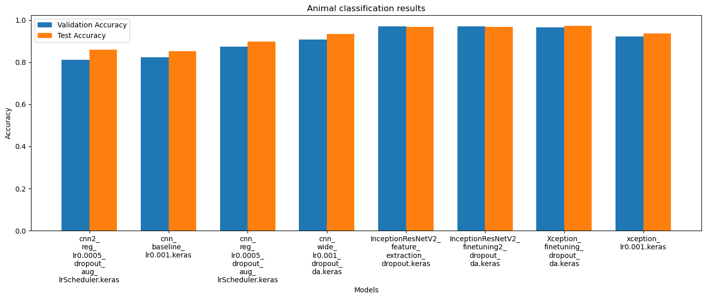

Exploratory Analysis of CNN Capabilities for Image Classification using Animals Dataset
===

This project involves an exploratory analysis of the capabilities of Convolutional Neural Networks (CNNs) for image classification, using a dataset of animal images. The goal is to understand how well CNNs can distinguish between different types of animals based on their images, and to identify best practices for training and evaluating these models.

## Dataset Description

The dataset used in this project is a collection of animal images, categorized into five classes: cats, dogs, elephants, horses & lions, collected from Google Images. Each class contains a variety of images that depict the animals in different poses and environments, providing a diverse and challenging set of images for classification. The dataset is available here ["Animals dataset"](https://www.kaggle.com/datasets/antobenedetti/animals/data).

## Results comparison



## Install the environment in a local device
The following steps must be followed to install the dependencies required for running the application:

1. Navigate to the project directory
```
cd (`project_path`)
```

2. Create a conda environment from a .yml file
```
conda env create -f environment.yml
```

## Project Structure
The project is organized as follows:

```
├── datasets
│   ├── animals 
├── output
│   ├── "generated models"
```

## Dependencies
The main libraries used in this project include:

- TensorFlow
- Keras
- Keras_Tuner
- NumPy
- Seaborn
- Pandas
- Matplotlib

## Model Architecture
The CNN model is designed with the following architecture:

- Input layer: Takes in images of a fixed size.
- Convolutional layers: Multiple layers with ReLU activation and max-pooling for feature extraction.
- Fully connected layers: Dense layers for classification, culminating in a softmax layer that outputs probabilities for each class.